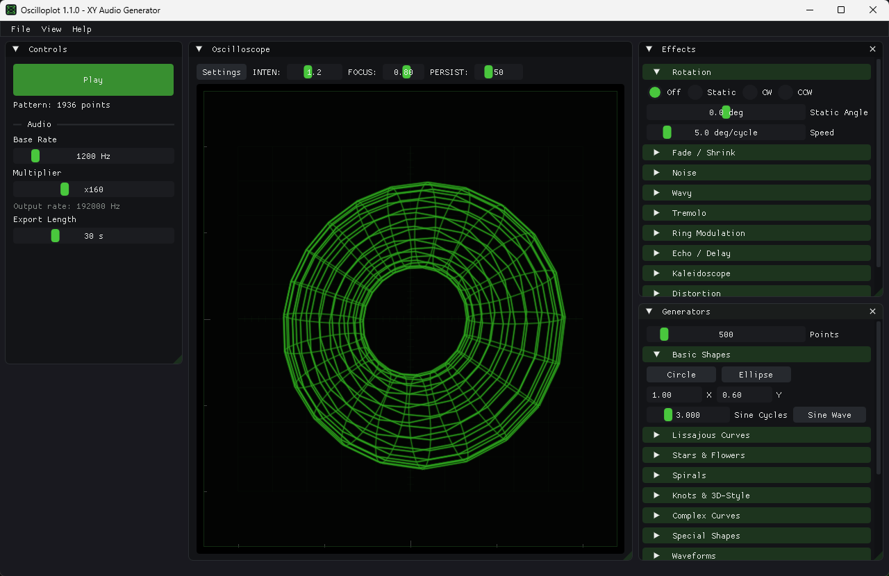
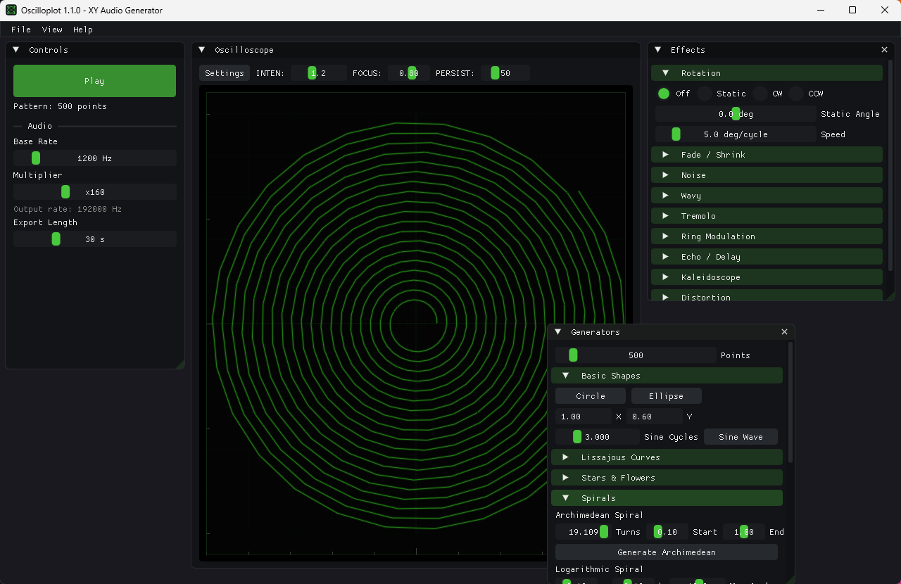
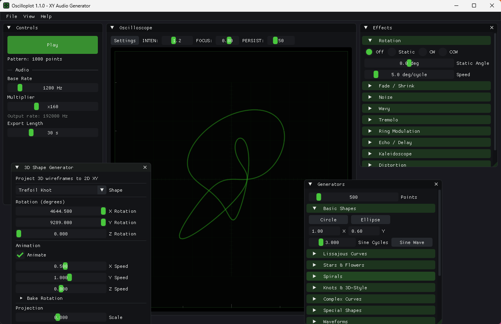
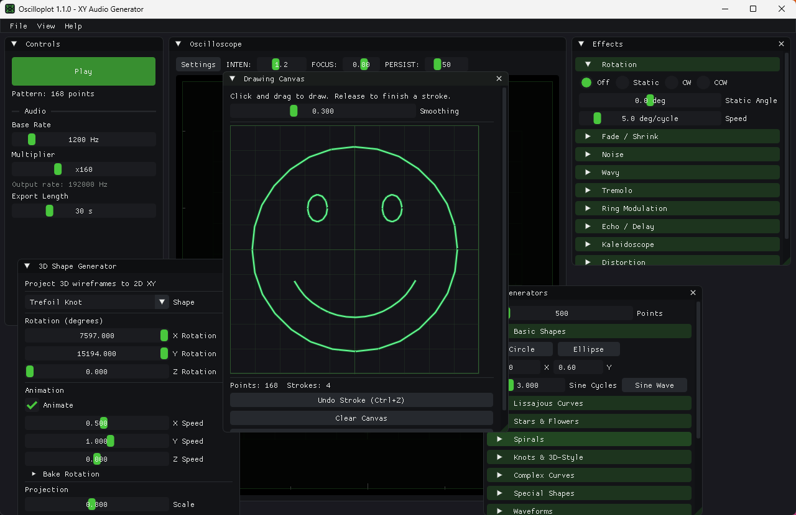
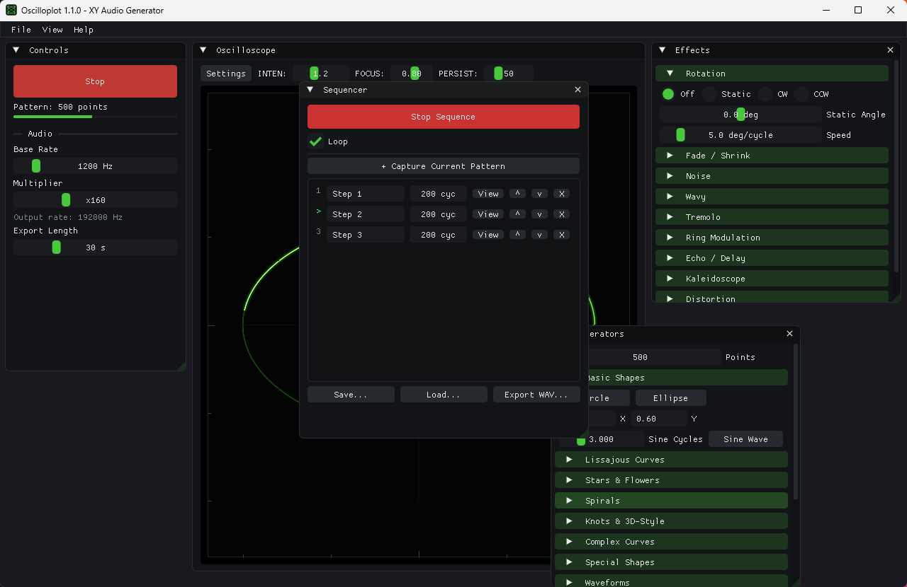
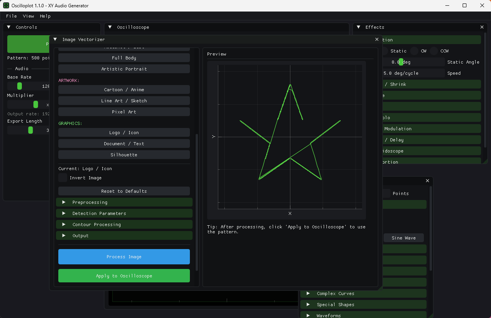

# Oscilloplot

A high-performance, cross-platform oscilloscope XY audio generator written in C++.



## Download

**[Download Latest Release (Windows x64)](https://github.com/jfalvarez1/oscilloplot/releases/latest)** - No installation required, just extract and run!

## Screenshots

**Live pattern generators** - every parameter applies instantly. Here a
19-turn Archimedean spiral being shaped with the Turns slider:



**3D wireframe shapes** - 20 shape sources including a rotating trefoil knot,
projected to XY in real time:



**Drawing canvas** - freehand strokes become oscilloscope patterns, with
per-stroke undo:



**Sequencer** - chain patterns into a timed sequence; here mid-playback on
step 2 with the phosphor beam tracing a circle:



**Image Vectorizer** - 13 detection modes turn images into traceable outlines:



## Features

- **Real-time XY oscilloscope visualization** at 120+ FPS
- **Physically-accurate CRT phosphor simulation** (Tektronix 465B inspired)
- **Low-latency audio playback** (<20ms latency)
- **Image Vectorizer** - Convert any image to oscilloscope patterns:
  - 13 specialized detection modes for different image types
  - Smart people detection with face emphasis
  - Works with photos, artwork, cartoons, logos, and more
- **Multiple pattern generators** with **live parameters** - once a generator is
  active, every one of its sliders redraws the scope instantly as you drag:
  - Basic shapes: circle, ellipse, sine wave
  - Lissajous curves with A:B ratio, phase, and 3:2 / 5:4 / 7:5 presets
  - Stars, flowers, rose curves
  - Archimedean and logarithmic spirals
  - Helix, trefoil knot, torus knot (p:q)
  - Butterfly, cardioid, deltoid, hypotrochoid, epitrochoid
  - Figure-8, infinity, heart
  - Square, sawtooth and triangle waveforms
  - Sum of harmonics with frequency/phase sweep (up to 8 terms per axis)
  - Random harmonics
  - **Drawing canvas** - freehand strokes with per-stroke undo (Ctrl+Z)
  - **Sound pad** - 16-step XY sequencer; click a cell to toggle its step,
    drag it to move its point, with circle/grid presets
- **3D Shape Generator** with 20 sources:
  - Platonic solids: Cube, Tetrahedron, Octahedron, Icosahedron, Dodecahedron
  - Curved surfaces: Sphere, Torus, Cylinder, Cone
  - Prisms: Pyramid, N-sided Prism
  - Complex shapes: 3D Spiral, Double Helix, Trefoil Knot
  - Topological: Mobius Strip, Klein Bottle
  - Special: Spring, 3D Star
  - **3D Text**: Type any text and render it as a rotating 3D wireframe!
  - **OBJ Model import**: load any Wavefront `.obj` mesh as a wireframe. The
    model is auto-centered and scaled to fit, and an adjustable edge cap keeps
    dense meshes traceable.
  - **Bake Rotation**: freeze N animation frames into one long pattern so
    playback and WAV export actually rotate.
- **Sequencer** (View > Sequencer): capture patterns as steps, reorder and
  rename them, set per-step cycle counts, loop, save/load as `.oseq`, and
  export the whole sequence as one WAV.
- **Rich effects pipeline**:
  - Rotation (static/animated)
  - X/Y axis fading
  - Shrink/unshrink
  - Noise injection
  - Wavy modulation
  - Tremolo
  - Ring modulation
  - Echo/delay
  - Kaleidoscope
- **File I/O** (File menu, or Ctrl+O / Ctrl+S / Ctrl+E):
  - Load patterns from text/CSV (`X, Y` per line), Oscilloplot binary (`.osc`),
    or MATLAB-style `.m` scripts
  - Save patterns as text or `.osc` binary
  - Export stereo WAV (left = X, right = Y) at the configured rate and duration
  - Import Wavefront `.obj` meshes; save/load sequences as `.oseq`
- **Standalone Windows build** - a single `oscilloplot.exe` with no DLLs and no
  VC++ Redistributable, running on any Windows 11 machine (SSE2 baseline,
  OpenGL 3.3 → 3.2 → 3.0 fallback, and audio is optional)
- **Cross-platform**: Windows, macOS, Linux

📖 **[Full User Manual](docs/user_manual.html)** - complete reference for every
panel, with setup instructions for connecting a real oscilloscope.

---

## Image Vectorizer - Complete Guide

The Image Vectorizer converts any image into oscilloscope-compatible vector patterns. It uses advanced edge detection algorithms to trace the outlines and features of your images.

### How to Access

1. Go to **View > Image Vectorizer** in the menu bar
2. The Image Vectorizer window will open

### Step-by-Step Usage

#### 1. Load an Image

1. Click **Browse...** to open a file dialog
2. Select your image file (PNG, JPG, JPEG, BMP, GIF, or TGA)
3. Click **Load Image**
4. The image dimensions will be displayed

#### 2. Choose the Right Mode

Select a mode that matches your image type. The vectorizer includes 13 specialized modes organized into categories:

##### PHOTOS (Blue)
| Mode | Best For | Algorithm |
|------|----------|-----------|
| **General Photo** | Landscapes, objects, general photography | Canny edge detection with Gaussian blur |
| **Portrait / Face** | People, faces, portraits | Bilateral filter (preserves edges while smoothing skin) + Canny |
| **High Detail** | Architecture, textures, detailed scenes | Canny with lower thresholds for maximum detail |

##### PEOPLE - Smart Detection (Orange)
| Mode | Best For | Algorithm |
|------|----------|-----------|
| **Face Focus** | Close-up face shots | YCbCr skin detection + face region estimation + regional Canny |
| **Headshot / Bust** | Head and shoulders portraits | Skin detection + bilateral filter + face-emphasized edges |
| **Full Body** | Complete figure with face detail | Full-body skin detection + face emphasis + silhouette |
| **Artistic Portrait** | Stylized line portraits | Face detection + Difference of Gaussians (DoG) + artistic simplification |

##### ARTWORK (Pink)
| Mode | Best For | Algorithm |
|------|----------|-----------|
| **Cartoon / Anime** | Cartoons, anime, cel-shaded art | Color quantization + median filter + edge detection |
| **Line Art / Sketch** | Pencil drawings, ink sketches | Difference of Gaussians (DoG) for line detection |
| **Pixel Art** | Pixel art, sprites, retro graphics | Direct threshold without blur (preserves sharp pixels) |

##### GRAPHICS (Green)
| Mode | Best For | Algorithm |
|------|----------|-----------|
| **Logo / Icon** | Logos, icons, high-contrast graphics | Simple binary threshold |
| **Document / Text** | Scanned documents, printed text | Adaptive local threshold (handles uneven lighting) |
| **Silhouette** | Solid shapes, shadows, outlines | High contrast threshold + morphological cleanup |

#### 3. Adjust Parameters (Optional)

Each mode has optimized default parameters, but you can fine-tune them:

##### Preprocessing
- **Blur**: Reduce noise before edge detection (0-5)
- **Brightness**: Adjust overall image brightness (-1 to 1)
- **Contrast**: Increase contrast for clearer edges (0.5-2)

##### Detection Parameters (Mode-Specific)

**For Photo/Canny modes:**
- **Low Threshold**: Weak edge threshold (pixels below are ignored)
- **High Threshold**: Strong edge threshold (optimal ratio 1:2 to 1:3)

**For Portrait mode:**
- **Filter Size**: Bilateral filter diameter (larger = more smoothing)
- **Color Sigma**: Color similarity range
- **Space Sigma**: Spatial smoothing range

**For People modes:**
- **Skin Sensitivity**: Skin color detection range (0.5-2)
- **Min Face Size**: Minimum face size as % of image
- **Detect Multiple Faces**: Find all faces or just the largest
- **Face Emphasis**: Detail enhancement in face region (1-3)
- **Background Simplify**: Simplification of non-face areas (1-5)

**For Line Art mode:**
- **Fine Detail (Sigma 1)**: Inner Gaussian blur for fine lines
- **Coarse Detail (Sigma 2)**: Outer Gaussian blur (should be > Sigma 1)
- **Line Threshold**: Sensitivity for line detection

**For Cartoon mode:**
- **Color Levels**: Number of color levels (fewer = more cartoon-like)
- **Edge Threshold**: Threshold for detecting color boundaries

**For Document mode:**
- **Block Size**: Size of local neighborhood for adaptive threshold
- **Constant C**: Offset from local mean

##### Contour Processing
- **Min Length**: Minimum points per contour (filters noise)
- **Simplify**: Douglas-Peucker simplification (higher = fewer points)
- **Connect Dist**: Maximum gap to bridge between contours
- **Close Contours**: Connect endpoints of nearly-closed shapes

##### Output
- **Max Points**: Maximum points in output pattern (1000-20000)

#### 4. Process the Image

1. Click **Process Image** (blue button)
2. Wait for processing to complete
3. The preview panel will show the vectorized pattern

#### 5. Apply to Oscilloscope

1. Click **Apply to Oscilloscope** (green button)
2. The pattern is now loaded in the main oscilloscope display
3. Press **Space** or click **Play** to hear and see the pattern

### Tips for Best Results

1. **Start with the right mode** - The mode selection is the most important step
2. **High contrast images work best** - Clear edges produce cleaner traces
3. **Adjust thresholds if needed** - Lower thresholds = more detail, higher = cleaner lines
4. **Use "Invert Image"** - If your image has light lines on dark background
5. **Reduce Max Points** - For smoother playback with less CPU usage
6. **Increase Simplify** - To reduce complexity while maintaining shape

### Example Workflows

**Portrait Photo:**
1. Load photo
2. Select "Face Focus" or "Headshot" mode
3. Process
4. If too much background detail, increase "Background Simplify"
5. Apply to oscilloscope

**Logo/Icon:**
1. Load image
2. Select "Logo / Icon" mode
3. Adjust Threshold if needed (higher for cleaner lines)
4. Process
5. Apply to oscilloscope

**Cartoon/Anime:**
1. Load image
2. Select "Cartoon / Anime" mode
3. Adjust Color Levels (fewer = simpler)
4. Process
5. Apply to oscilloscope

---

## Technology Stack

| Component | Library |
|-----------|---------|
| Windowing/Input | SDL2 |
| GUI | Dear ImGui |
| Plotting | ImPlot |
| Audio I/O | PortAudio |
| Audio Files | libsndfile |
| FFT | PocketFFT |
| Math | GLM |

## Building from Source

### Prerequisites

- CMake 3.20+
- C++17 compiler (MSVC 2019+, GCC 9+, Clang 10+)
- Git

### Windows (with vcpkg)

The default Windows build is **standalone**: every dependency is linked
statically, so the result is a single `oscilloplot.exe` with no SDL2.dll,
portaudio.dll, or sndfile.dll beside it, and no VC++ Redistributable required.

```powershell
# 1. Setup external dependencies (ImGui, ImPlot, PocketFFT)
./setup_externals.ps1

# 2. Configure and build. The static triplet is selected automatically;
#    vcpkg installs the dependencies from vcpkg.json on first configure.
cmake -B build -S . -DCMAKE_TOOLCHAIN_FILE="[vcpkg-root]/scripts/buildsystems/vcpkg.cmake"
cmake --build build --config Release

# 3. Run
./build/Release/oscilloplot.exe
```

To build against DLLs instead (faster incremental links during development):

```powershell
cmake -B build-dyn -S . -DOSCILLOPLOT_STANDALONE=OFF `
      -DCMAKE_TOOLCHAIN_FILE="[vcpkg-root]/scripts/buildsystems/vcpkg.cmake"
cmake --build build-dyn --config Release
```

### Build Options

| Option | Default | Effect |
|--------|---------|--------|
| `OSCILLOPLOT_STANDALONE` | `ON` | Single self-contained .exe (static deps + static CRT, GUI subsystem, no console window). `OFF` links against DLLs. |
| `OSCILLOPLOT_SIMD_LEVEL` | `SSE2` | SIMD baseline: `SSE2`, `AVX`, or `AVX2`. |
| `OSCILLOPLOT_ENABLE_SIMD` | `ON` | Master switch for the SIMD baseline above. |
| `OSCILLOPLOT_ENABLE_LTO` | `ON` | Link-time optimization on Release. |
| `OSCILLOPLOT_ENABLE_NATIVE` | `OFF` | `-march=native` (GCC/Clang). Not portable. |

## Windows Compatibility

Release builds are made to run on **any** Windows 11 machine (and Windows 10
back to 1607), not just modern hardware:

- **SSE2 SIMD baseline.** `AVX2` is faster but faults with an illegal
  instruction on anything older than Haswell (2013), including machines running
  Windows 11 via an unsupported-hardware install. Build with
  `-DOSCILLOPLOT_SIMD_LEVEL=AVX2` for a faster binary tied to your own CPU.
- **OpenGL fallback chain.** The app tries 3.3 Core, then 3.2 Core, then 3.0,
  instead of demanding 3.3 outright — older integrated graphics often advertise
  only 3.0 or 3.2 while being perfectly capable of running this UI. OpenGL 3.0
  is a hard floor: ImGui's renderer requires vertex array objects, which do not
  exist before then. A machine with no graphics driver at all (Microsoft Basic
  Display Adapter, some VMs and Remote Desktop sessions) offers only OpenGL 1.1
  and cannot be supported without shipping a software renderer; it now gets an
  explanatory dialog instead of exiting silently.
- **Audio is optional.** With no output device the app still opens; the
  visualizer and file export work, and the menu bar says `[No audio device]`.
- **Static CRT.** No VC++ Redistributable install needed.
- **Application manifest.** Declares Windows 10/11 support (so version APIs
  aren't shimmed), per-monitor-v2 DPI awareness, long-path support, and a UTF-8
  ANSI code page for non-ASCII file paths.

### macOS

```bash
# 1. Setup external dependencies
chmod +x setup_externals.sh
./setup_externals.sh

# 2. Install dependencies via Homebrew
brew install sdl2 portaudio libsndfile glm

# 3. Configure and build
cmake -B build -S . -DCMAKE_BUILD_TYPE=Release
cmake --build build

# 4. Run
./build/oscilloplot
```

### Linux (Ubuntu/Debian)

```bash
# 1. Setup external dependencies
chmod +x setup_externals.sh
./setup_externals.sh

# 2. Install dependencies
sudo apt update
sudo apt install libsdl2-dev libportaudio2 libportaudiocpp0 portaudio19-dev \
                 libsndfile1-dev libglm-dev libgl1-mesa-dev

# 3. Configure and build
cmake -B build -S . -DCMAKE_BUILD_TYPE=Release
cmake --build build

# 4. Run
./build/oscilloplot
```

## Usage

### Keyboard Shortcuts

- **Space**: Play/Stop (ignored while typing in a text field)
- **Ctrl+O**: Load pattern
- **Ctrl+S**: Save pattern
- **Ctrl+E**: Export WAV
- **Ctrl+Z**: Undo stroke (Drawing Canvas focused)

### Quick Start

1. Launch the application
2. Select a pattern generator from the Generators panel
3. Adjust audio parameters (sample rate, duration, repeats)
4. Enable effects as desired
5. Press Space or click Play to hear the audio and see the visualization

### Audio Output

The application outputs stereo audio where:
- **Left channel (X)**: Horizontal deflection
- **Right channel (Y)**: Vertical deflection

Connect to an oscilloscope in X-Y mode to visualize the patterns on hardware.

## Performance Targets

| Metric | Target |
|--------|--------|
| Preview FPS | 120+ |
| CPU Usage | <20% |
| Audio Latency | <20ms |
| Memory Usage | <50MB |

## Future Roadmap

- [ ] MIDI input support
- [ ] VST plugin hosting
- [x] Pattern sequencing (Sequencer panel)
- [x] 3D shape import (OBJ files)

## License

MIT License - see [LICENSE](LICENSE) for details.

## Acknowledgments

- [Dear ImGui](https://github.com/ocornut/imgui) - Immediate mode GUI
- [ImPlot](https://github.com/epezent/implot) - Real-time plotting
- [PortAudio](http://www.portaudio.com/) - Cross-platform audio
- Original Python version: [oscilloplot_gui](https://github.com/jfalvarez1/oscilloplot_gui)
